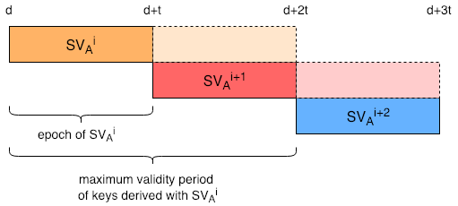
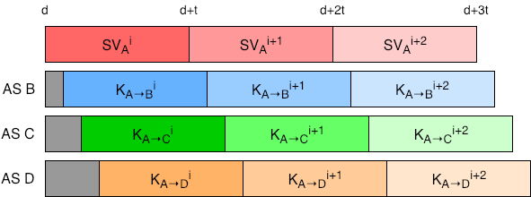
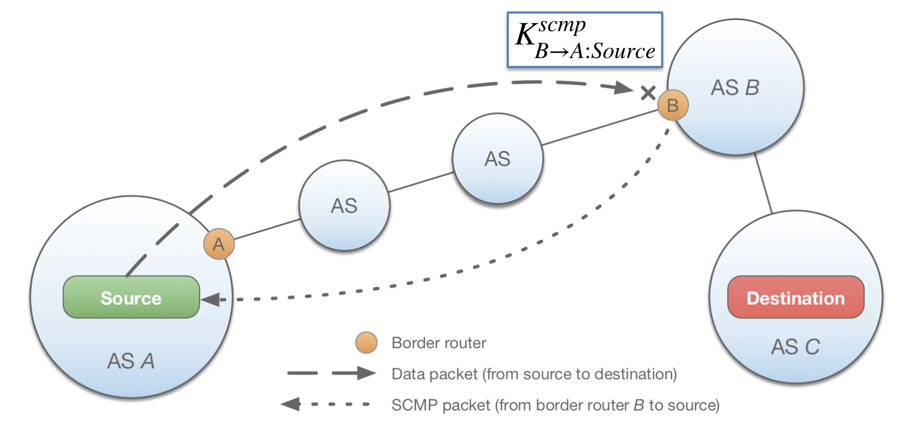

# Dynamically Recreatable Key (DRKey) Infrastructure

This document presents the design for the Dynamically Recreatable Key (DRKey)
infrastructure.

- Author: Benjamin Rothenberger
- Last updated: 2019-02-28
- Status: draft

## Overview

The DRKey protocol enables routers and end hosts to derive symmetric
cryptographic keys on-the-fly from a single local secret.

DRKey is used for:

- SCMP
- SIBRA / COLIBRI
- Security Extension
- PISKES
- OPT

## Notation

    |                     bitstring concatenation
    ^                     superscript
    _                     subscript

    PRF_K (X)             pseudorandom function using key K and taking X as an input
    {X}_PK_A              public key encryption using public key of AS A
    {X}_PK_A^-1           public key signing using private key of AS A

    A                     autonomous system
    H_A                   end host identified by their IP address
    CS_A                  certificate server located in AS A

    SV_A                  AS A's local secret value
    K_{A→B}               symmetric key between AS A and AS B with direct key derivation for AS A
    K_{A:H_A→B:H_B}^{p}   symmetric key between host H_A in AS A and host H_B in AS B for protocol 'p'
    DS_{A→B}^{p}          delegation secret between AS A and AS B for protocol 'p'

Note that the arrow notation does *not* refer to the directionality of the key, but
rather states for which entity the key derivation must be efficient. For example,
`K_{A→B:H_B}` can be used in both direction of communication, but is directly
derivable by AS A, whereas host `H_B` might be required to fetch a key from its
local CS.

## Design

In the DRKey protocol, key establishment is offloaded to the certificate server
(CS). Each certificate server selects a local secret value, which is only shared
with trustworthy entities in the same AS; it is never shared outside the AS. The
secret value will serve as the root of a symmetric key hierarchy, where keys of
a level are derived from keys of the preceding level using an efficient
Pseudo-Random Function (PRF). Thanks to the one-way property of the PRF, the
derived key can be shared with another entity without disclosing the higher level
symmetric key. This system ensures rapid key derivation on the service side,
whereas a slower key fetch is required by a client to a local certificate server.

### Key Hierarchy

                              SV_A                          (0th level)
                                |
                         +------+-----....
                         |
                      K_{A→B}                               (1st level)
                         |
        +----------------+-------------------+---...
        |                |                   |
    K_{A→B}^{p}    K_{A→B:H_B}^{p}    K_{A:H_A→B:H_B}^{p}   (2nd level)

#### 0th-level

On the zeroth level of the hierarchy, each AS A randomly generates a local and
AS-specific secret value SV\_A. The secret value represents the per-AS basis of
the hierarchy and is renewed frequently. This is not shared with any entity outside
the AS.

#### 1st-level

Given the AS-specific secret value, an AS can derive pairwise symmetric keys
destined for other ASes from this secret value. These derived keys form the
first level of the key hierarchy and are called first-level keys. For example, a
first-level key that is used between AS A and AS B, is derived as follows:

     K_{A→B} = PRF_{SV_A} (B)

where SV\_A is the AS-specific secret value from the zeroth level of the key
hierarchy.

#### 2nd-level

Using the symmetric keys of the first level of the hierarchy, second-level keys
are derived to provide symmetric keys to hosts within the same AS. Second-level
keys can be established between a pair of AS infrastructure nodes (such as
border routers or servers), end hosts or a combination of both. For example, a
key between end hosts H\_A in AS A and H\_B in AS B is derived as follows:

    K_{A:H_A→B:H_B}^{prot} = PRF_K_{A→B} (“prot” | H_A | H_B)

where “prot” denotes an arbitrary protocol, and H\_A and H\_B represent host
addresses. We distinguish between IPv4, IPv6 and service addresses.

### Key Validity

#### Epochs

An epoch is an interval between a starting and end point in time. The length of
epochs can be chosen by a given AS and can change over time. However, epochs
must not overlap. Thus, a secret value is associated with exactly one epoch.

#### Validity Periods

Secret values must be renewed for every epoch. Thus, also lower level keys
must be renewed at the beginning of a new epoch. However, if the key used to
authenticate a packet expires while the packet is in transit, the packet could no
longer be verified by the receiver. To avoid race conditions, the validity of
second-level keys exceeds the epoch end time by a small extent. By default, we
assume a epoch length of 24 hours and the following key validity periods:

- Secret value: 24 hours
- First-level keys: 24 hours (inherited) + maximum offset (see Key Rollover)
- Second-level keys: 24 (inherited) + maximum offset (see Key Rollover) + 0.1 hours

First- and second-level keys are valid during the same time frame as the
corresponding secret value. If a specific protocol requires shorter key expiration
times, this will be implemented as an extension to the basic protocol. The 'misc'
part in the key exchange is used to supply such additional information.

### Key Establishment

#### First-Level Key Exchange

To exchange a first-level key the certificate servers of corresponding ASes
perform the key exchange protocol. The key exchange is initialized by CS\_B by
sending the following request:

    token = A | val_time | timestamp
    CS_B → CS_A : A | B | token | {token}_PK_B^−1

where `val_time` specifies a point in time at which the requested key is valid.
The requested key may not be valid at the time of request, either because it
already expired or because it will become valid in the future. For example,
prefetching future keys allows for seamless transition to the new key. Thus,
`val_time` is used to identify the epoch in which the requested key can be used.
In case `val_time` is close to the end of the current epoch, the CS will also
include the key for the next epoch.

To sign and encrypt the first level key exchange, AS-level certificate
distributed using the SCION control-plane PKI are used. The request token is
signed with B’s private key to prove authenticity of the request. Upon receiving
the initial request, CS\_A checks the signature and timestamp for authenticity
and expiration. If the request has not yet expired, the certificate server
CS\_A will reply with an encrypted and signed first-level key derived from the
local secret value SV\_A. SV\_A is chosen according to the epoch identified by
`val_time`.

    K_{A→B} = PRF_{SV_A} (B)
    ciphertext = {A | K_{A→B}}_PK_B
    signature = {ciphertext | epoch_begin | epoch_end | timestamp}_PK_A^−1
    CS_A → CS_B : ciphertext | epoch_begin | epoch_end | timestamp | signature

Once the requesting certificate server CS\_B has received the key, it shares it
among other local certificate servers to ensure a consistent view. Each
certificate server can now respond to queries by entities within the same AS
requesting second-level keys derived from K_{A→B}.

The first-level key is accompanied by `epoch_begin` and `epoch_end` that denote
the begin and end of the validity period of the corresponding key. These values
are determined by the AS that issues the key. The beginning of an epoch must
not overlap with the end of the previous epoch, as otherwise multiple
DRKeys need to be checked for verification. Additionally, a packet that is
authenticated using DRKey should contain a timestamp to avoid clock drift
issues.

First-level keys of frequently contacted ASes are prefetched such that
second-level keys can be instantaneously derived. In case a certificate server
is missing a first-level key that is required for the derivation of a
second-level key, the certificate server initiates a first-level key exchange.
The amount of cached first-level keys is configurable by each AS. We suggest a
default policy of caching 10'000 first-level keys, where the least frequently
used keys get replaced. This requires fetching on average one first-level key
every 8 seconds (assuming a key lifetime of 24h).

#### Second-Level Key Exchange

End hosts request a second-level key from their local certificate server with
the following request format:

    {keyType, requestID, protocol, srcIA, dstIA, srcHost, dstHost, misc}

`keyType` defines which type of second-level key is requested. Currently,
there exist three types of second-level keys: AS-to-AS, AS-to-end-host, and
end-host-to-end-host. `misc` is used to supply additional information that
might be required for protocol-specific keys (e.g., shorter key lifetime).

An end host H\_A in AS A uses this format for issuing the following request to
its local certificate server CS\_A:

    H_A → CS_A : format | val_time | timestamp

Similar to the first-level key exchange, 'val\_time' specifies a point in time at
which the requested key is valid.
The certificate server only replies with a key to requests with a valid
timestamp, and if the querying host is authorized to use the key at the specified
point in time. An authorized host must either be an end point of the communication
that is authenticated using the second-level key, or authorized separately by the
AS. The following second-level requests exist:

    1. AS → AS:
    Request: { 0, req.ID, prot, A, B, ⊥, ⊥, ⊥ }

    2. AS → end host
    Request: { 1, req.ID, prot, A, B, ⊥, H_B, ⊥ }

    3. end host → end host:
    Request: { 2, req.ID, prot, A, B, H_A , H_B, ⊥ }

### Second-level Key Derivation

The key derivation for second-level keys can be defined by each protocol. By
default, the DRKey infrastructure offers two key derivation procedures. For
these, we distinguish between protocols that perform key derivations only on
trusted AS infrastructure (e.g., SCMP), and protocols that can profit from
"outsourcing" key derivation to AS-owned infrastructure entities (e.g., PISKES).
In the former case, key derivation can be performed as follows:

    1. AS → AS:
    Key Derivation: K_{A→B}^prot = PRF_{K_{A→B}}( “prot” )

    2. AS → end host
    Key Derivation: K_{A→B:H_B}^prot = PRF_{K_{A→B}} ( “prot” | H_B )

    3. end host → end host:
    Key Derivation: K_{A:H_A→B:H_B}^prot = PRF_{K_{A→B}} ( “prot” | H_A | H_B )

In the latter case, where key derivation should be performed by AS-owned
entities, we introduce an intermediate step:

    SV_A
     |
    K_{A→B}
     |
    DS_{A→B}^{prot}
     |
    K_{A:H_A→B:H_B}^{prot}

The delegation secret `DS_{A→B}^{prot}` can be shared with services to enable
them to locally derive second-level keys in a single derivation step. On the
client-side, the CS is required to perform an additional derivation step to
get a second-level key. This is particularly useful for AS-controlled services
that require authentication of the first packet. The secret of the intermediate
step is derived as follows:

    DS_{A→B}^{prot} = PRF_{K_{A→B}} ( “prot” )

Consequently, the second-level key derivation is adapted:

    1. AS → AS:
    Key Derivation: K_{A→B}^prot =  DS_{A→B}^{prot} (no derivation required)

    2. AS → end host
    Key Derivation: K_{A→B:H_B}^prot = PRF_{DS_{A→B}^{prot}} ( H_B )

    3. end host → end host:
    Key Derivation: K_{A:H_A→B:H_B}^prot = PRF_{DS_{A→B}^{prot}} ( H_A | H_B )

Other protocols could also introduce other procedures to derive second-level
keys. However, the CSes of both participating ASes must be upgraded to support
the additional derivation mechanism.

### Key Rollover

Shared symmetric keys are short-lived to avoid explicit key revocation. However,
letting all keys expire at the same time would lead to peaks in key requests.
Such peaks can be avoided by spreading out key expiration, which in turn will
lead to spreading out the fetching requests. To this end, we introduce the
following deterministic mapping:

    offset : (A, B) → [0, t)

that uniformly maps the AS identifiers of the source in AS A and the destination
in AS B to a range between 0 and the maximum lifetime t of SV\_A. The offset is
used to determine the validity period of a key by determining the secret value
SV\_A^j that is used to derive K_{A→B} at the current sequence j such that:

    [ start(SV_A^j) + offset(A, B), start(SV_A^j+1) + offset(A, B) )

The offset function is AS-specific. By default, we suggest to use a function
that uniformely distributes the offset values in the following interval:

    [0, minimum epoch length / 2 )

For prefetching of DRKeys, a `valTime` that exceeds the end of the current epoch
can be selected. To allow seamless key rollover, an entity is required to store
secret values of the current, previous, and next epoch. In case a key for a
different epoch is requested, an AS is not required to return a corresponding
key.

## Implementation

The implementation of the protocol will consist of the first-level key exchange
between CS. The second-level key exchange is implemented between sciond and CS.
Additionally, a key store needs to be implemented to cache keys.

### Key Derivation

As a key derivation function we will use AES-CMAC as a single block operation,
which can be performed in less than 100 cycles on a modern CPU. The input to
the key derivation function looks as follows:

#### 0th-level

As secret values are directly derived from an AS-specific secret, we need to use
a secure password-based key derivation function. We use `PBKDF2` with at least
1000 iterations of `Sha256`.

Data input:

    secLen      uint8
    secret      []byte
    date        []byte

#### 1st-level

Key input:

    SV_A        []byte

Data input:

    DstIA       uint64

#### 2nd-level (default)

Key input:

    K_{A→B}    []byte

Data input:

    1. AS → AS:
    ProtoLen    uint8
    Protocol    []byte
    KeyType     uint8

    2. AS → end host:
    ProtoLen    uint8
    Protocol    []byte
    KeyType     uint8
    DstHostLen  uint8
    DstHost     []byte

    3. end host → end host:
    ProtoLen    uint8
    Protocol    []byte
    KeyType     uint8
    SrcHostLen  uint8
    DstHostLen  uint8
    SrcHost     []byte
    DstHost     []byte

The input size of the PRF depends on the address type that is used to
address end hosts.

#### 2nd-level (with intermediate step)

Key input:

    DS_{A→B}^{p} []byte

Data input:

    1. AS → AS:
    KeyType     uint8

    2. AS → end host:
    KeyType     uint8
    DstHostLen  uint8
    DstHost     []byte

    3. end host → end host:
    KeyType     uint8
    SrcHostLen  uint8
    DstHostLen  uint8
    SrcHost     []byte
    DstHost     []byte

### First Level Key Exchange

For the first-level key exchange between CS, we can use SignedCtrlPld. Thus,
the request ID, timestamp, signature, certificate and TRC version do not need
to be part of the protocol. For the response, certVerDst describes the version
of the certificate used to encrypt the message. Furthermore, all time-specific
data such as timestamps, validity time, or expiration time are specified as
the time in seconds since the unix epoch.

    DRKeyLvl1Req {
        isdas       UInt64  # Src ISD-AS of the requested DRKey
        valTime     UInt32  # Point in time where requested DRKey must be valid. Used to identify the epoch.
    }

    DRKeyLvl1Rep {
        isdas       UInt64  # Src ISD-AS of the DRKey
        epochBegin  UInt32  # Begin of validity period of DRKey
        epochEnd    UInt32  # End of validity period of DRKey
        cipher      Data    # Encrypted DRKey
        certVerDst  UInt64  # Version of cert of public key used to encrypt
    }

### Second Level Key Exchange

The second level key response will also be transmitted with SignedCtrlPld.

    DRKeyLvl2Req {
        valTime     UInt32  # Point in time where requested DRKey must be valid. Used to identify the epoch.
        protocol    Data    # Protocol identifier
        keyType     UInt8   # Key type of requested DRKey
        srcIA       UInt64  # Src ISD-AS of the requested DRKey
        dstIA       UInt64  # Dst ISD-AS of the requested DRKey
        srcHost     Data    # Src Host of the request DRKey (optional)
        dstHost     Data    # Dst Host of the request DRKey (optional)
        misc        Data    # Additional information for DRKey derivation (optional)
    }

    DRKeyLvl2Rep {
        timestamp   UInt32  # Timestamp
        drkey       Data    # Derived DRKey
        epochBegin  UInt32  # Begin of validity period of DRKey
        epochEnd    UInt32  # End of validity period of DRKey
        misc        Data    # Additional information (optional)
    }

### Key Store

As a key store, we will use sqlite. It is already used in sciond and CS to cache
certificates and TRCs.

The key store also stores the begin and end of an epoch for an individual key.

### Offset Function

The offset function to spread out key expiration is implemented as follows:

    hash(srcAS | dstAS) % mod (min epoch length / 2)

As a hash function, we will use the non-cryptographic hash function
`MurmurHash3`. It provides a good distribution, while being faster than an
unkeyed cryptographic hash function. However, as this function is local to an AS,
it can be replaced to receive a different key expiration spread. Remote ASes don't
need to be aware of the offset function that is used, as the key lifetime is
included in the exchange.

## DRKey Use Cases

Key selection in DRKey is based on which entity requires fast key derivation
(without querying the required key at the certificate server). In the following,
we discuss an example usages of DRKey where key derivation is performed on border
routers (BR).

### Key derivation by AS infrastructure

In the case where key derivation is performed by BRs (e.g., SCMP), the BR must be
able to directly derive the key without requiring to fetch an additional key.

For example, a host in AS A sends a data packet to a host in AS C, but forwarding
fails (e.g., due to an expired hop field) at the ingress interface of AS B’s border
router `BR_B`. The router creates an SCMP message, which describes the problem. When
the packet is created, then `BR_B` derives a key for authenticating packets destined
for the source based on the key shared with AS A and calculates a MAC over the
packet. Theoretically either `K_{B→A:Source}` or `K_{A:Source→B}` could be used to
authenticate the packet. However, as AS B shares its secret value `SV_B` with
`BR_B`, `BR_B` can directly derive all first- and second-level keys `K_{B→*}`. Thus,
`K_{B→A:Source}` must be used for authenticating the SCMP message. On the source
side, the host either has the same key already cached, or it contacts its CS and
queries the missing key.

